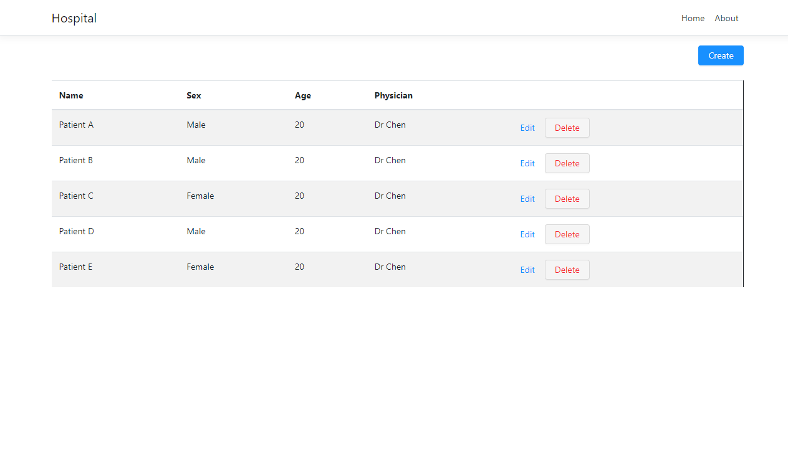
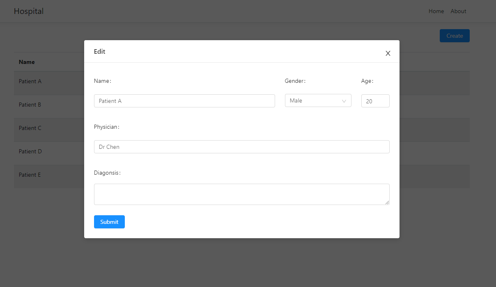
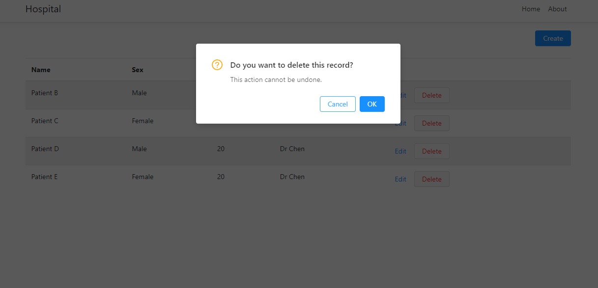
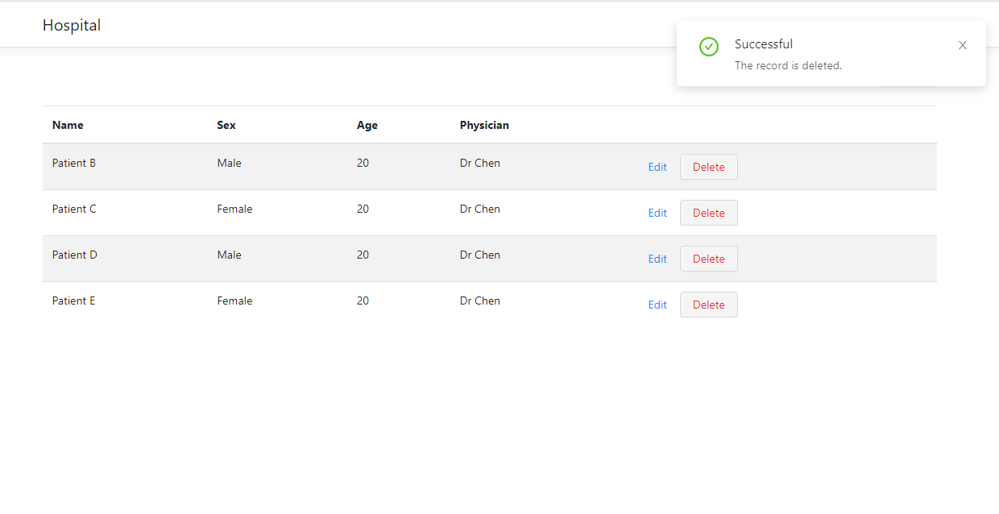

# README

The project conssit of the angular frontend and the net core 3.1 api backend communicating via API.

## Frontend

Frontend is developed using angular framework and can be deployed independently
but need to change API base url. The NG Zorro framework is used for implementing
basic component such as forms, button, numeric input , modal and notification pop up.

## Database

The entityframework is used for the database mapper. Thus is easier to mapped to various database.

```
// For Testing and running locally
services.AddDbContext<DBContext>(options => options.UseInMemoryDatabase("HospitalDB"));

// Postgres Setup required
//services.AddDbContext<DBContext>(options =>
//options.UseNpgsql(Configuration.GetConnectionString("DefaultConnection")));
```

I have use in memory database for testing the database context and API controller. Note. In memoory database reset
on each execution.

The postgres database is chosen for this implementation, since it was already installed in my system.
The connection url is added on the appsettings.json for default connection "Host=localhost;Port=5432;Username=postgres;Password=password;Database=Hospital;".
Note: The username and password should match with the postgres Database and migration should
run manually.

```
dotnet ef database update
```

## API controller

The api controller support basic CRUD function for patient record. I also have added *.http file
for testing REST API.You can use the visual code extension for calling the REST API [VS extension]([https://marketplace.visualstudio.com/items?itemName=humao.rest-client)

## Screenshots




